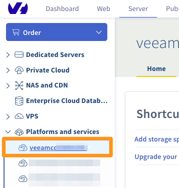
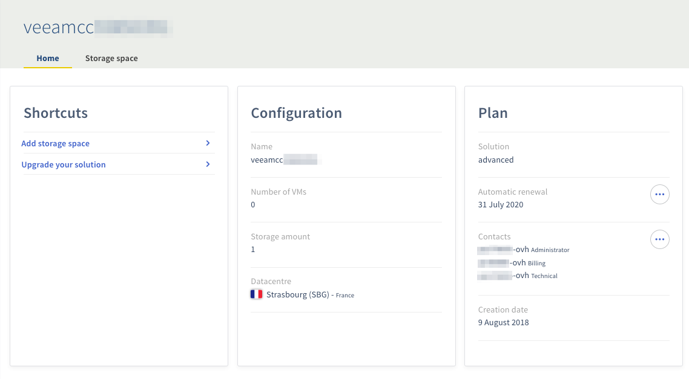
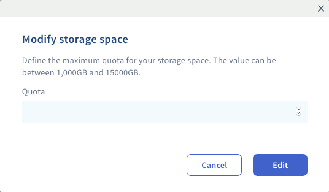
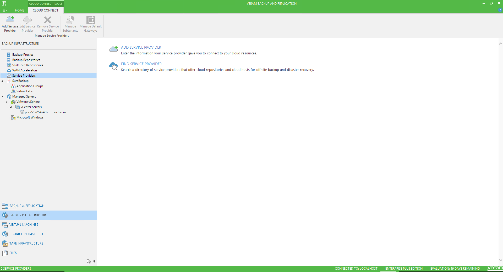
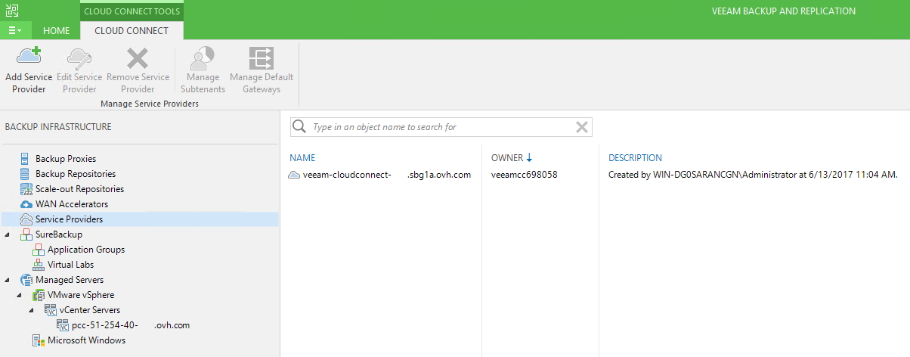
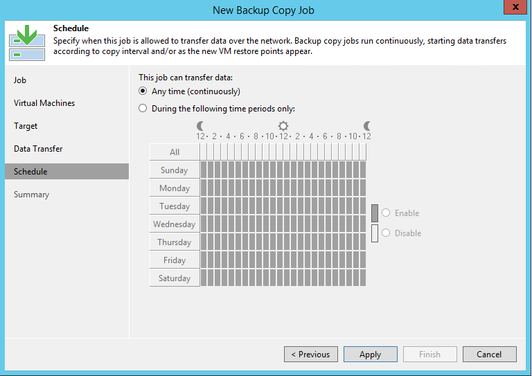

**Letzte Aktualisierung am 07.12.2021**

## Ziel

Veeam Cloud Connect ist eine "Off-Site"-Backup-Lösung. Sie bietet eine einfache und sichere Möglichkeit, Cloud-Backups zu verwalten, ohne eine Infrastruktur an einem zweiten Standort verwalten zu müssen.

**Diese Anleitung erklärt die Einrichtung und Nutzung von Veeam Cloud Connect.**

## Voraussetzungen

- Sie haben das [Veeam Cloud Connect](https://www.ovh.com/de/storage-solutions/veeam-cloud-connect/){.external} Angebot abonniert.
- Sie verfügen über kompatible Dienste (bei OVHcloud oder extern)

> [!primary]
>
> Unsere Veeam Angebote sind derzeit nicht mit der neuesten von Veeam angebotenen Version (11) kompatibel. OVHcloud wird Version 10 bis auf weiteres anbieten. Bitte beachten Sie diesen Punkt bei der Veeam-Konfiguration Ihrer Dienstleistungen.
>

### Kompatible Dienste

Der Hauptvorteil von Veeam Cloud Connect liegt – abgesehen von der Einfachheit der Nutzung – darin, dass es funktioniert, unabhängig davon, wo Ihre Betriebsinfrastruktur gehostet wird. Es kann bei OVHcloud, einem anderen Anbieter oder an Ihren eigenen Standorten gehostet werden.

Liste kompatibler OVHcloud Dienste:

- [Hosted Private Cloud](https://www.ovhcloud.com/de/enterprise/products/hosted-private-cloud/)
- auf unseren [Dedicated Servern](https://www.ovh.com/de/dedicated_server/) gehostete virtuelle Maschinen, die via Microsoft Hyper-V oder VMware ESXi verwaltet werden

## In der praktischen Anwendung

### Angebot bestellen

Sie können das Angebot über unsere [Webseite](https://www.ovh.com/de/storage-solutions/veeam-cloud-connect/) bestellen.

Wenn die Zahlung abgeschlossen ist, erhalten Sie eine E-Mail mit folgenden Angaben:

- IP-Adresse/Name Ihres Dienstes
- Benutzer und Passwort

### Verwalten des Dienstes im OVHcloud Kundencenter

Wechseln Sie in Ihrem OVHcloud Kundencenter in den Bereich "Hosted Private Cloud" und dann zu `Plattformen und Dienstleistungen`.

{.thumbnail}

Klicken Sie auf Ihren neuen Dienst, um den Tab `Start` anzuzeigen, wo einige allgemeine Informationen angezeigt werden.

{.thumbnail}

Im zweiten Tab, `Storage`, finden Sie den Namen, den belegten Speicherplatz, die Nutzungsquote und das Rechenzentrum für die Replikation Ihres Storage.

{.thumbnail}

Über den Button `...`{.action} können Sie die Quote für Ihren Speicherplatz ändern.

{.thumbnail}

Definieren Sie das neue Kontingent und klicken Sie auf `Bearbeiten`{.action}, um zu bestätigen.

{.thumbnail}

### Einrichten des Dienstes mit der Veeam Konsole

Veeam Cloud Connect und der benötigte Veeam Backup-Server werden von der Veeam Backup & Replication Konsole aus verwaltet, die über die offizielle [Veeam-Webseite](https://www.veeam.com/) verfügbar ist.

Im ersten Schritt fügen Sie den Dienst Ihrer Konsole hinzu, indem Sie im Menü "Service Providers" auf `ADD SERVICE PROVIDER`{.action} klicken.

{.thumbnail}

Tragen Sie die IP-Adresse oder den Namen Ihrer Lösung (per E-Mail erhalten) aus und klicken Sie auf `Next`{.action}.

{.thumbnail}

Fügen Sie in diesem Schritt den Benutzernamen und das Kennwort hinzu, und klicken Sie auf `OK`{.action} und dann auf `Apply`{.action}.

{.thumbnail}

Eine Zusammenfassung der verfügbaren Ressourcen für diesen Dienst wird angezeigt.

{.thumbnail}

Klicken Sie auf der letzten Seite ("Summary") auf `Finish`{.action}.

{.thumbnail}

Ihr Dienst wird damit in die Übersicht in der Konsole aufgenommen.

{.thumbnail}

### Konfigurieren von Backup-Tasks

Im linken Menü wechseln Sie zum Abschnitt "BACKUP & REPLICATION". Ihre Backup-Tasks ("Jobs") werden hier aufgelistet.

Klicken Sie auf `Backup Copy`{.action} in der oberen Menüleiste, um einen neuen Task zu konfigurieren.

{.thumbnail}

Geben Sie dem Task zunächst eine Namen. Sie können auch die Häufigkeit dieser Aktion festlegen.

{.thumbnail}

Auf der nächsten Seite "Virtual Machines" können Sie VMs mit der Schaltfläche `Add`{.action} hinzufügen. In der [offiziellen Dokumentation](https://helpcenter.veeam.com/archive/backup/95/vsphere/backup_copy_vms.html) können Sie detaillierte Erklärungen zu den Optionen nachlesen.

In diesem Beispiel wird “from backups” ausgewählt.

{.thumbnail}

Als Nächstes wählen Sie das Repository aus, das dem Dienst zugewiesen wurde (zuvor auf der "Resources"-Seite bei der Einrichtung angezeigt).

{.thumbnail}

Um Daten von Ihrem Server an die OVHcloud Infrastruktur zu übertragen, gibt es zwei Möglichkeiten. Abhängig von der verfügbaren Verbindung können Sie “Direct” auswählen oder den Veeam WAN Accelerator Service verwenden.

Die genaue Funktionsweise des Dienstes wird auf [dieser Seite](https://helpcenter.veeam.com/archive/backup/95/vsphere/wan_hiw.html) erklärt.

{.thumbnail}

Nachdem Sie auf `Next`{.action} geklickt haben, können Sie die Zeiträume angeben, in denen die Datenübertragung stattfinden darf.

{.thumbnail}

Klicken Sie auf der Seite "Summary" auf `Finish`{.action}.

{.thumbnail}

Falls die entsprechenden Terminierungsbedingungen erfüllt sind, wird der neue Task sofort gestartet und Sie können ihn auf der Seite `HOME` einsehen.

{.thumbnail}

### Wiederherstellen von Backups

Um eine Sicherung wiederherzustellen, klicken Sie mit der rechten Maustaste auf den Task in der Tabelle. Sie können auswählen, die gesamte virtuelle Maschine wiederherzustellen, oder nur bestimmte Dateien.

{.thumbnail}

Wählen Sie im Assistenten ("Restore Wizard") die VM und das zu wiederherstellende Backup aus.

{.thumbnail}

Als Nächstes wählen Sie den “Restore Mode” aus (zum originalen oder einem anderen Speicherort).

{.thumbnail}

Sie können zusätzlich einen Grund für die Wiederherstellung zu Dokumentationszwecken angeben. Abschließend wird eine Zusammenfassung des Vorgangs angezeigt.

{.thumbnail}

Klicken Sie auf `Finish`{.action}, und in Ihrer Veeam Konsole wird ein Fenster geöffnet, in dem die laufenden Tasks angezeigt werden.

In Ihrem vSphere Client können Sie sehen, dass verschiedene Ereignisse protokolliert werden, wenn eine Wiederherstellung gestartet wurde.

{.thumbnail}

## Weiterführende Informationen

Für den Austausch mit unserer User-Community gehen Sie auf [https://community.ovh.com/en/](https://community.ovh.com/en/).
