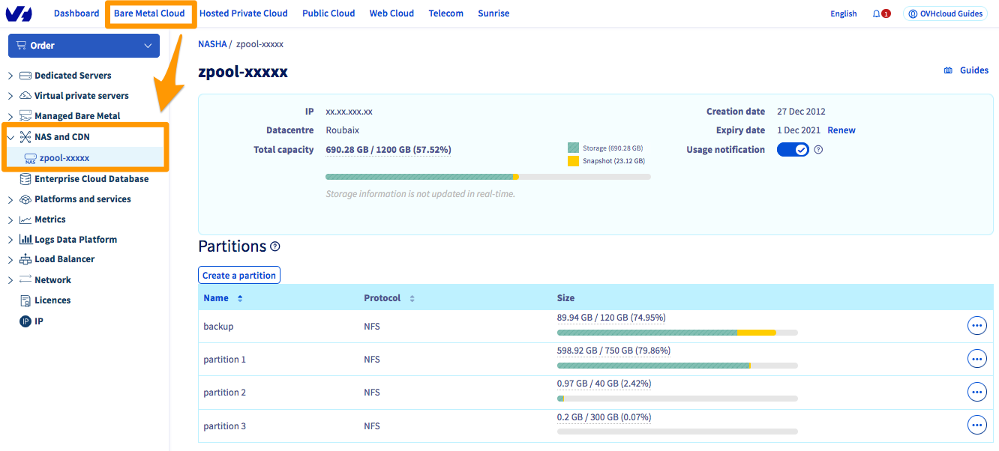
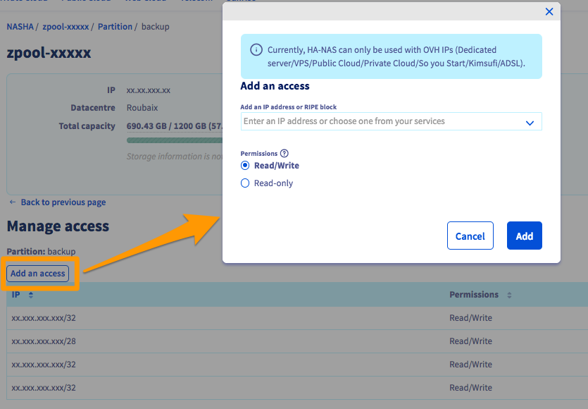

> [!primary]
> Tłumaczenie zostało wygenerowane automatycznie przez system naszego partnera SYSTRAN. W niektórych przypadkach mogą wystąpić nieprecyzyjne sformułowania, na przykład w tłumaczeniu nazw przycisków lub szczegółów technicznych. W przypadku jakichkolwiek wątpliwości zalecamy zapoznanie się z angielską/francuską wersją przewodnika. Jeśli chcesz przyczynić się do ulepszenia tłumaczenia, kliknij przycisk “Zaproponuj zmianę” na tej stronie.
>

**Ostatnia aktualizacja z dnia 16-09-2021**

## Wprowadzenie

NAS (Network Attached Storage) jest serwerem plików podłączonym do sieci, którego główną funkcją jest przechowywanie danych w scentralizowanym woluminie dla niejednorodnych klientów sieciowych.

## Wymagania początkowe

- Posiadanie adresu IP powiązanego z usługą OVHcloud (Hosted Private Cloud, Serwer dedykowany, VPS, Instancja Public Cloud, itp.)
- Posiadanie usługi [NAS-HA](https://www.ovh.pl/nas/)
- Dostęp do [Panelu klienta OVHcloud](https://www.ovh.com/auth/?action=gotomanager&from=https://www.ovh.pl/&ovhSubsidiary=pl){.external}.

## W praktyce

Zarządzanie usługą NAS-HA odbywa się w [Panelu klienta](https://www.ovh.com/auth/?action=gotomanager&from=https://www.ovh.pl/&ovhSubsidiary=pl){.external}.

Po zalogowaniu kliknij `Bare Metal Cloud`{.action}, a następnie `NAS i CDN`{.action} w menu po lewej stronie. Kliknij Twoją usługę, aby uzyskać dostęp do menu administracyjnego.

{.thumbnail}

### Utwórz partycję

Aby dodać nową partycję, kliknij `Utwórz partycję`{.action}.

{.thumbnail}

Wystarczy podać **nazwę partycji**, jej **rozmiar** oraz zatwierdzony **protokół** (NFS lub CIFS).

{.thumbnail}

### Zmień rozmiar partycji

Aby zmienić rozmiar partycji, kliknij przycisk `(...)`{.action} znajdujący się po prawej stronie odpowiedniej partycji, a następnie `Zmień rozmiar`{.action}.

{.thumbnail}

Wskaż nowy rozmiar i zatwierdź.

### Zmień częstotliwość kopii zapasowych snapshot

Snapshot zawartości serwera NAS wykonywany jest automatycznie co godzinę i zapisywany jest na serwerze NAS.

Możesz utworzyć do 3 dodatkowych snapshotów z różnymi częstotliwościami, które będą również zapisane na serwerze NAS.

W tym celu kliknij przycisk `(...)`{.action} znajdujący się po prawej stronie odpowiedniej partycji, a następnie `Częstotliwość snapshotów`{.action}.

{.thumbnail}

Wybierz nową częstotliwość, a następnie zatwierdź.

### Utwórz zrzut migawki

Poza snapshotami wykonanymi automatycznie, w każdej chwili możesz utworzyć zrzut partycji. W tym celu kliknij przycisk `(...)`{.action} znajdujący się po prawej stronie partycji, a następnie `Snapshot`{.action}.

{.thumbnail}

Nazwij snapshot i kliknij na `Dodaj`{.action}

### Dodawanie dostępu

Aby uzyskać dostęp do utworzonej wcześniej partycji, należy skonfigurować dostęp.

> [!primary]
>
> Do serwera NAS mają dostęp wyłącznie adresy IP usług OVHcloud (np.: serwera dedykowanego, VPS, instancję Public Cloud, itp..)
>

Aby zezwolić IP na dostęp do usługi NAS, kliknij przycisk `(...)`{.action} znajdujący się po prawej stronie istniejącej partycji, a następnie `Zarządzaj dostępami`{.action}.

{.thumbnail}

Następnie kliknij `Dodaj dostęp`{.action} i wybierz adres IP Twojego produktu OVHcloud.
 Należy również określić, czy dostęp do tego adresu IP jest dozwolony tylko do odczytu (*Read-only*) lub odczytu/zapisu (*Read/Write*)

{.thumbnail}

#### Usuwanie dostępu

Aby usunąć dostęp do partycji, kliknij przycisk `(...)`{.action} znajdujący się po prawej stronie odpowiedniego adresu IP, a następnie `Usuń`{.action}.

{.thumbnail}

### Ustawienia Z File System (ZFS)

> [!warning]
>
> Wszystkie ustawienia ZFS są zoptymalizowane. Chociaż nie zalecamy modyfikacji tych parametrów, menu to pozwala na dostosowanie ZFS używanego przez NAS-HA.
>

Aby zmienić ustawienia ZFS dla partycji, kliknij przycisk `(...)`{.action} po prawej stronie odpowiedniej partycji, a następnie `Ustawienia Z File System (ZFS)`{.action}.

{.thumbnail}

- **Wyłącz aktualizację czasu dostępu (*atime*)**: Wyłączenie *atime* oznacza, że jądro nie będzie aktualizować znacznika czasu systemu plików przy każdym dostępie do pliku. Może to być przydatne w przyspieszaniu częstych operacji odczytu, np. na statycznych stronach WWW. Nie zaleca się jednak dezaktywacji tej opcji dla aplikacji krytycznych pod względem spójności, takich jak bazy danych.
- **ZFS recordsize**: Ta właściwość zmienia maksymalny rozmiar bloku w systemie plików ZFS. Pamiętaj, że ZFS będzie nadal używać mniejszy rozmiar bloku, jeśli plik jest mniejszy niż maksymalny rozmiar. Na przykład plik o rozmiarze 16 KB użyje bloku o rozmiarze 16 KB (plus metadane), aby nie zmarnować przestrzeni dyskowej. W związku z tym nie zalecamy modyfikacji ZFS *recordsize*.
- **Sync**: Ten parametr zmienia zachowanie transakcji w systemie plików ZFS w odniesieniu do zapisu danych RAM i zapisu danych na dysku. Nie zalecamy modyfikacji tej właściwości, chyba że jest to powód szczególny.

### Usuwanie partycji

> [!alert]
>
> Usunięcie partycji spowoduje całkowite i definitywne usunięcie wszystkich zawartych w niej danych.
>

Aby usunąć partycję, kliknij przycisk `(...)`{.action} znajdujący się po prawej stronie istniejącej partycji, a następnie `Usuń`{.action}.

{.thumbnail}

## Sprawdź również

Dołącz do społeczności naszych użytkowników na stronie <https://community.ovh.com/en/>.
