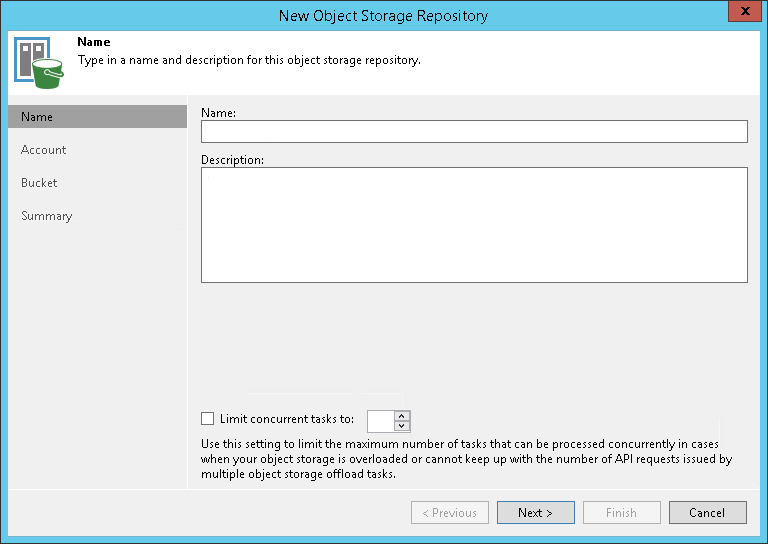
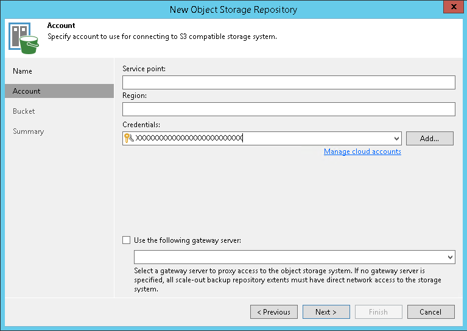
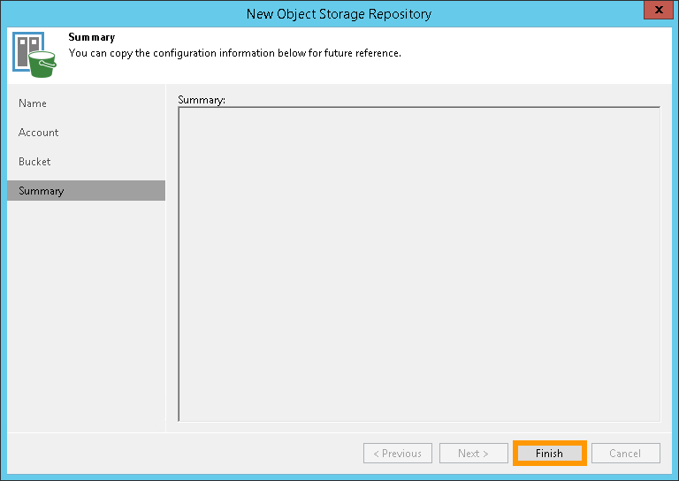

**Dernière mise à jour le 3/01/2022**

## Objectif

Ce guide a pour objectif de vous montrer comment configurer Veeam pour utiliser votre espace de stockage S3 Object Storage.

> [!warning]
>
> OVHcloud met à votre disposition des services dont la configuration, la gestion et la responsabilité vous incombent. Il vous revient de ce fait d'en assurer le bon fonctionnement.
>
> Nous mettons à votre disposition ce guide afin de vous accompagner au mieux sur des tâches courantes. Néanmoins, nous vous recommandons de faire appel à un [prestataire spécialisé](https://partner.ovhcloud.com/fr/) et/ou de contacter l'éditeur du logiciel si vous éprouvez des difficultés. En effet, nous ne serons pas en mesure de vous fournir une assistance. Plus d'informations dans la section « Aller plus loin » de ce guide.
>

## Prérequis

- Avoir créé un bucket
- Avoir créé un utilisateur et avoir défini les droits d'accès requis sur le bucket
- Connaître vos informations d'identification S3 (access_key et secret_access_key)

Consultez notre guide « [Débuter avec S3 Object Storage](https://docs.ovh.com/fr/storage/s3/debuter-avec-s3/) » pour plus de détails.

## En pratique

### Ajout d'un stockage d'objets compatible avec S3

#### Étape 1 - lancer l'assistant Nouveau Référentiel d'Objets

Pour lancer l'assistant **Nouveau référentiel d'objets**, effectuez l'une des opérations suivantes :

- Ouvrez la vue **Infrastructure de sauvegarde**. Dans le volet d'inventaire, sélectionnez le nœud **Dépôts de sauvegarde** et cliquez sur `Ajouter un dépôt`{.action} sur le ruban. Dans la boîte de dialogue **Add Backup Repository**, sélectionnez `Object Storage`{.action} > `S3 Compatible`{.action}.

- Ouvrez la vue **Infrastructure de sauvegarde**. Dans le panneau d'inventaire, faites un clic-droit sur le nœud **Dépôts de sauvegarde** et sélectionnez `Ajouter un dépôt de sauvegarde`{.action}. Dans la boîte de dialogue **Add Backup Repository**, sélectionnez `Object Storage`{.action} > `S3 Compatible`{.action}.

{.thumbnail}

#### Étape 2 - spécifier le nom du stockage d'objets

À l'étape **Nom** de l'assistant, indiquez un nom et une description pour le référentiel de stockage d'objets :

- Dans le champ **Nom**, indiquez un nom pour le nouveau référentiel de stockage d'objets.
- Dans le champ **Description**, saisissez une description facultative. La description par défaut contient des informations sur l'utilisateur qui a ajouté le référentiel de stockage d'objets, ainsi que la date et l'heure auxquelles le référentiel de stockage d'objets a été ajouté.  

Si vous souhaitez limiter le nombre maximum de tâches pouvant être traitées en même temps, cochez la case **Limiter les tâches simultanées à N**.

{.thumbnail}

#### Étape 3 - spécifier le compte de stockage d'objets

À l'étape **Compte** de l'assistant, spécifiez les paramètres de connexion :

- Dans le champ **Point de service**, spécifiez une adresse de point de terminaison de votre stockage d'objets compatible S3 : `https://s3.<region_in_lowercase>.perf.cloud.ovh.net`

- Dans le champ **Région**, indiquez une région : `<region_in_lowercase>`.

- Dans la liste déroulante **Credentials**, sélectionnez les informations d'identification de l'utilisateur pour accéder à votre stockage d'objets compatibles S3.

Si vous avez déjà un enregistrement d'informations d'identification qui a été configuré à l'avance, sélectionnez-le dans la liste déroulante. Sinon, cliquez sur `Ajouter`{.action} et fournissez vos clés d'accès et secrètes. Vous pouvez également cliquer sur le lien `Gérer les comptes cloud`{.action} pour ajouter, modifier ou supprimer un enregistrement d'informations d'identification.

Pour utiliser un serveur de passerelle, cochez la case **Utiliser le serveur de passerelle suivant** et choisissez un serveur approprié dans la liste. Vous pouvez souhaiter utiliser un serveur passerelle, par exemple, si votre organisation dispose de NAT ou de différents types de pare-feu et que votre accès à Internet est limité.

Vous pouvez sélectionner tout serveur Microsoft Windows ou Linux ajouté à votre infrastructure de sauvegarde et disposant d'une connexion à Internet. Par défaut, le rôle d'un serveur passerelle est attribué à la machine où Veeam Backup & Replication est installé.

Si vous choisissez de ne pas utiliser un serveur passerelle, assurez-vous que toutes les extensions de référentiel scale-out ont un accès direct à Internet.

{.thumbnail}

#### Étape 4 - spécifier les paramètres du stockage d'objets

À l'étape **Bucket** de l'assistant, spécifiez le bucket et le dossier qui seront utilisés pour stocker les données :

1. Dans la liste déroulante **Bucket**, sélectionnez un bucket. Assurez-vous que le bucket dans lequel vous souhaitez stocker vos données de sauvegarde a été créé à l'avance.
2. Dans le champ **Select Folder**, sélectionnez un dossier cloud vers lequel vous souhaitez mapper votre référentiel de stockage d'objets.

Pour sélectionner un dossier, cliquez sur `Parcourir`{.action} et sélectionnez un dossier existant ou créez-en un nouveau en cliquant sur `Nouveau dossier`{.action}.

Pour définir une limite souple qui peut être dépassée temporairement pour votre consommation de stockage d'objets, cochez la case **Limiter la consommation de stockage d'objets à** et fournissez la valeur en TB ou PB.

{.thumbnail}

#### Étape 5 - finir de travailler avec l'assistant

À l'étape **Résumé** de l'assistant, terminez la configuration du référentiel de stockage d'objets :

- Examinez les détails du référentiel de stockage d'objets.
- Cliquez sur `Finish`{.action} pour quitter l'assistant.

{.thumbnail}

## Aller plus loin

Échangez avec notre communauté d'utilisateurs sur [https://community.ovh.com](https://community.ovh.com){.external}.
