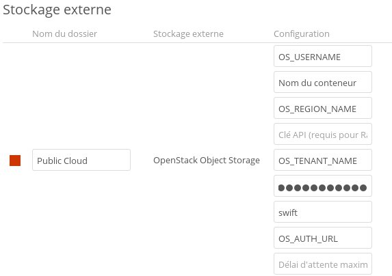

##
[Owncloud](https://owncloud.org/) to aplikacja do przechowywania danych online i zarządzania plikami.
Proponuje ona funkcjonalności takie jak na przykład synchronizowanie między kilkoma urządzeniami.
Można również dodawać zewnętrzną przestrzeń dyskową, zwłaszcza Object Storage OpenStack.

Przewodnik ten wyjaśnia, jak skonfigurować aplikację OwnCloud dla Object Storage.


## Wymagania

- Pobranie pliku OpenRC z panelu klienta OVHcloud lub z interfejsu Horizon
- [Dodanie przestrzeni dyskowej](https://docs.ovh.com/pl/public-cloud/dodanie_przestrzeni_dyskowej/) dla aplikacji Owncloud


## Instalacja
W pierwszej kolejności zainstaluj aplikację OwnCloud:


```
root@instance:~$ apt-get install owncloud
```


## Uwaga!
Sprawdź, czy korzystasz z dobrych repozytoriów. Należy zainstalować najnowszą wersję aplikacji OwnCloud.
Następnie można zainstalować MySQL, aby dysponować bazą danych, której potrzebuje aplikacja OwnCloud:


```
root@instance:~$ apt-get install mysql-server
```


## Konfiguracja
Po zakończeniu instalacji możemy przejść do konfiguracji bazy danych, która będzie używana przez OwnCloud.
Logujemy się na serwer MySQL za pomocą hasła root, które skonfigurowaliśmy podczas jego instalacji:


```
root@instance:~$ mysql -u root -p
```


Następnie możemy utworzyć nowego użytkownika i bazę danych dla OwnCloud:


```
**** Tworzenie użytkownika *****
mysql> CREATE USER 'owncloud'@'localhost' IDENTIFIED BY 'P@ssw0rd';

***** Tworzenie bazy danych *****
mysql> CREATE DATABASE `owncloud` ;

***** Następnie nadajemy użytkownikowi "owncloud" wszystkie uprawnienia do bazy danych "owncloud"
mysql> GRANT ALL PRIVILEGES ON `owncloud` . * TO 'owncloud'@'localhost';
```


Po wykonaniu tych czynności możemy zalogować się do interfejsu OwnCloud za pomocą przeglądarki wpisując http://I.P.serwera/owncloud:

{.thumbnail}

W interfejsie tym można:

- Założyć konto administratora.
- Podać katalog danych (fakultatywnie, jeśli chcesz używać tylko usługi Object Storage, pozostaw w tym przypadku ustawienie domyślne).
- Podać dane do bazy danych.


Po zaakceptowaniu uzyskasz dostęp do interfejsu OwnCloud.
W interfejsie tym włączymy aplikację pozwalającą nam na dodanie obsługi zewnętrznej przestrzeni dyskowej.
Kliknij na przycisk "Plik" w górnym lewym rogu i wybierz "Aplikacja":

{.thumbnail}

Aby włączyć aplikację "External storage support" w menu aplikacji "Wyłączonych":

{.thumbnail}

Teraz możemy przejść do skonfigurowania tej aplikacji. Kliknij na nazwę użytkownika w górnym prawym rogu i na "Administracja":

{.thumbnail}

Wybierz sekcję "Sekcja zewnętrzna" i dodaj typ przechowywania "OpenStack Object Storage":

{.thumbnail}

Należy tu podać informacje z pliku "OpenRC":

- Identyfikator użytkownika Horizon odnoszący się do pola "OS_USERNAME" w pliku "OpenRC"
- Nazwa kontenera utworzonego wcześniej dla aplikacji Owncloud
- Nazwa regionu, w którym znajduje się kontener, odnosi się do pola "OS_REGION_NAME"
- Nazwa dzierżawcy, odnowsząca się do pola "OS_TENANT_NAME"
- Hasło użytkownika Horizon
- Nazwa usługi odnosząca się do "swift"
- Adres punktu dostępowego, odnosi się do pola "OS_AUTH_URL" czyli "https://auth.cloud.ovh.net/v2.0"


"Klucz API" i "Maksymalny czas oczekiwania" to wartości fakultatywne.

## Przypomnienie
Kontener, który utworzyłeś musi być dedykowany aplikacji OwnCloud, ponieważ aplikacja ta będzie konfigurować poszczególne metadane dla Twojego kontenera.
Po wpisaniu wszystkich informacji i sprawdzeniu ich poprawności, czerwony kwadrat przed nazwą katalogu zmieni kolor na zielony. Będzie on dostępny z poziomu Twojej strony głównej w sekcji "Zewnętrzna przestrzeń":

{.thumbnail}


##
[Przewodniki Cloud]({legacy}1785)
