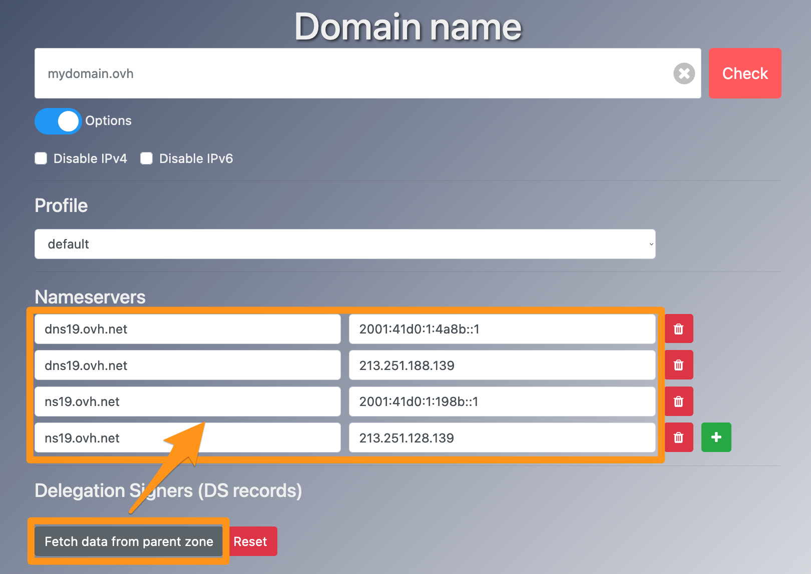
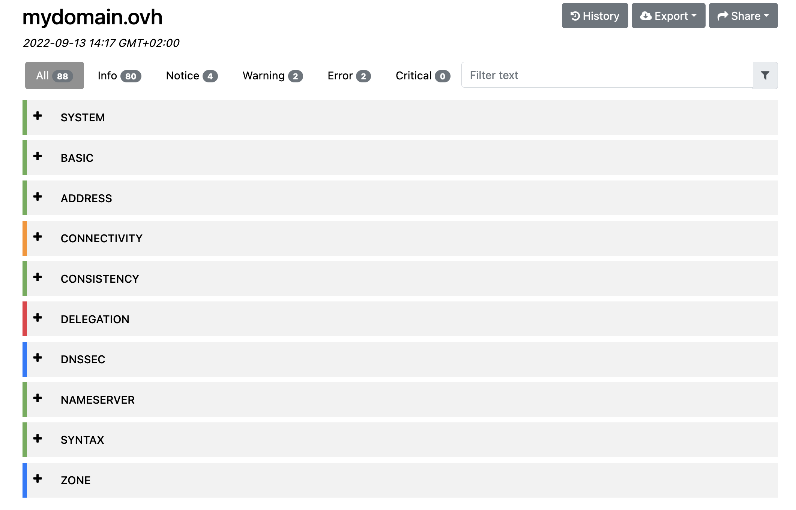

**Dernière mise à jour le 12/09/2022**

> [!warning]
>
> OVHcloud met à votre disposition des services dont la configuration, la gestion et la responsabilité vous incombent. Il vous revient de ce fait d'en assurer le bon fonctionnement.
> 
> Nous vous recommandons de faire appel à un [prestataire spécialisé](https://partner.ovhcloud.com/fr/) si vous éprouvez des difficultés. En effet, nous ne serons pas en mesure de vous fournir une assistance. Plus d'informations dans la section [« Aller plus loin »](#go-further) de ce tutoriel.
> 

## Objectif

[Zonemaster](https://zonemaster.fr/) est un outil né de la collaboration entre l'[AFNIC](https://www.afnic.fr/) (registre français) et [The Swedish Internet Foundation](https://internetstiftelsen.se/en/) (registre suédois). Il permet d'analyser la configuration DNS (Domain Name System) d'un nom de domaine et d'identifier les éléments qui peuvent être améliorés ou corrigés.

> [!primary]
>
> Pour mieux comprendre la notion de DNS, consultez l'introduction de notre guide sur la [configuration d'une zone DNS](https://docs.ovh.com/fr/domains/editer-ma-zone-dns/).

## Prérequis

- Disposer d'un [nom de domaine](https://www.ovhcloud.com/fr/domain/)

## En pratique

### Champ de saisie

L'outil Zonemaster permet de vérifier une configuration DNS en place sur un nom de domaine ou de tester une zone DNS préconfigurée sur des futurs serveurs DNS.

Pour vérifier la configuration actuelle d'un nom de domaine, saisissez votre nom de domaine puis cliquez sur `Check`{.action}

{.thumbnail}

Pour vérifier une configuration DNS que vous avez préparée mais pas encore appliquée au nom de domaine concerné, cochez la case `Options`{.action}, puis saisissez les informations suivantes :

- **Serveurs DNS** : Saisissez les informations du serveur DNS associé à un nom de domaine, puis cliquez sur le `+`{.action} pour valider votre saisie. La saisie d'une adresse IP est facultative.
- **Délégation du Signataire (enregistrement DS)**: Dans le cadre d'une protection DNSSEC, saisissez les éléments de l'enregistrement DS, puis cliquez sur `+`{.action} pour ajouter la valeur. Si les serveurs DNS n'utilisent pas le protocole DNSSEC, vous pouvez laisser ces champs libres.

Vous pouvez également forcer les vérifications sur un protocole IP spécifique, via les cases `Désactiver IPv6` et `Désactiver IPv4`

> **Exemple**:   Vous possédez le nom de domaine « mydomain.ovh » qui utilise actuellement les serveurs DNS « dns19.ovh.net » et  « ns19.ovh.net ».
>
>Vous avez configuré une zone DNS pour ce nom domaine sur les serveurs DNS « mydns.test.ovh » et « mydns2.test.ovh ». 
> Avant de changer les serveurs DNS, vous pouvez effectuer une recherche avancée à la l'aide de la case `Options`{.action} en saisissant « mydns.test.ovh » et « mydns2.test.ovh » dans les cases `Serveurs DNS`. 
> Zonemaster réalisera un test comme si vous utilisiez les serveurs « mydns.test.ovh » et « mydns2.test.ovh » sur « mydomain.ovh ». 
> {.thumbnail}

> [!primary]
>
> Lorsque vous saisissez un nom de domaine et que vous cliquez sur le bouton `Obtenir les données de la zone parente`{.action}, les serveurs DNS associés au nom de domaine apparaitront ainsi que les informations de l'enregistrement DS (DNSSEC) si celui-ci a été configuré.
>
> {.thumbnail}

### Résultat

Une fois le formulaire validé, les résultats sont classés par code couleur :

- **Vert** : Cette partie est fonctionnelle et répond aux critères standard dans sa catégorie.
- **Orange** : Cette partie est fonctionnelle, mais mérite une attention particulière. L'outil a détecté qu'un paramètre ne répond pas au standard de sa catégorie, sans que cela ne bloque son fonctionnement.
- **Rouge** : Cette partie présente des erreurs ou des éléments manquants pouvant causer un dysfonctionnement  . 
- **Bleu** : Il s'agit d'une simple information, sans conséquence particulière sur le fonctionnement du nom de domaine.

{.thumbnail}

### Informations utiles

Si vous avez des questions supplémentaires au sujet de Zonemaster, consultez la rubrique [FAQ](https://zonemaster.net/faq) sur <https://zonemaster.fr/>.

## Aller plus loin

[Généralités sur les serveurs DNS](../generalites-serveurs-dns/){.external}.

[Modification d'une zone DNS](https://docs.ovh.com/fr/domains/editer-ma-zone-dns/){.external} DNS OVHcloud.

[Protégez votre domaine contre le Cache Poisoning avec le DNSSEC](https://www.ovhcloud.com/fr/domains/dnssec/){.external}.

Pour des prestations spécialisées (référencement, développement, etc), contactez les [partenaires OVHcloud](https://partner.ovhcloud.com/fr/).

Si vous souhaitez bénéficier d'une assistance à l'usage et à la configuration de vos solutions OVHcloud, nous vous proposons de consulter nos différentes [offres de support](https://www.ovhcloud.com/fr/support-levels/).

Échangez avec notre communauté d'utilisateurs sur <https://community.ovh.com>
