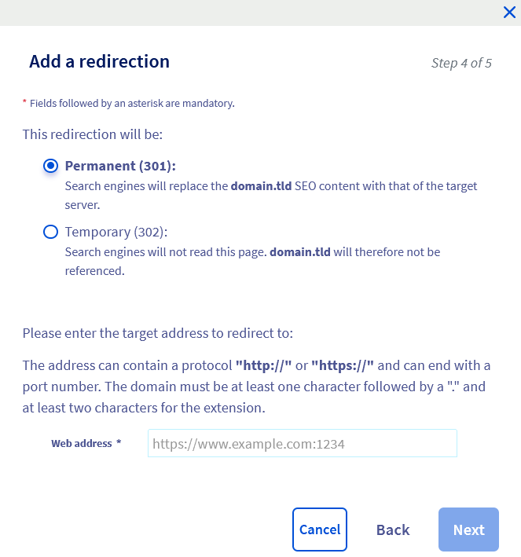
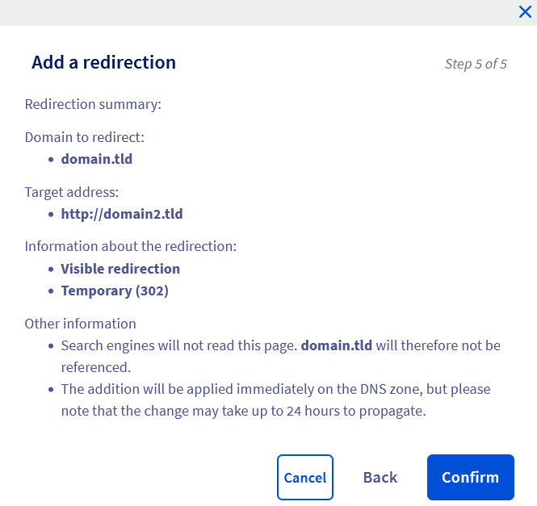
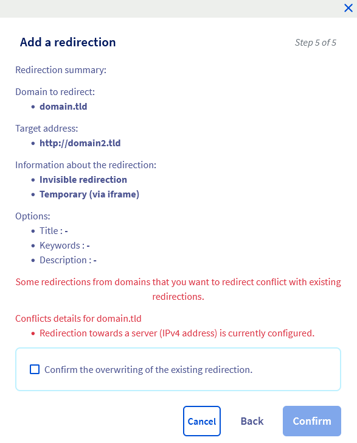

**Dernière mise à jour le 15/09/2022**

## Objectif

La redirection d'un nom de domaine permet de rediriger celui-ci vers une nouvelle cible. Il existe différents types de redirections qui répondent à des besoins spécifiques.

**Découvrez les différents types de redirections et comment en créer une pour un nom de domaine géré par OVHcloud.**

## Prérequis

- Disposer d'un [nom de domaine](https://www.ovhcloud.com/fr/domains/)
- Être connecté à votre [espace client OVHcloud](https://www.ovh.com/auth/?action=gotomanager&from=https://www.ovh.com/fr/&ovhSubsidiary=fr){.external}.
- Être connecté à votre hébergement web (pour une redirection via un fichier [".htaccess"](#htaccess_Rewrite)).

## En pratique

### Comprendre la redirection d'un nom de domaine

Cette fonctionnalité permet de rediriger un domaine/sous-domaine vers :

- un autre domaine/sous-domaine déjà existant :
**Exemple** : domain.tld
- une URL (Uniform Resource Locator) de site internet :
**Exemples** : http://www.domain.tld/welcome/ ou https://www.domain.tld/welcome/ (si le domaine cible dispose d'un certificat SSL compatible).

Ces actions peuvent être réalisée de plusieurs manières :

- **depuis l'[espace client OVHcloud](https://www.ovh.com/auth/?action=gotomanager&from=https://www.ovh.com/fr/&ovhSubsidiary=fr)** : un assistant de configuration permet de paramétrer votre redirection
- **depuis une méthode nécessitant de la programmation** : vous devrez créer vous-même la redirection dans un fichier (généralement un [".htaccess"](#htaccess_Rewrite)).

> [!warning]
>
> La mise en place d'une redirection peut avoir des conséquences sur le référencement de votre site internet. 
> Soyez vigilant quant aux manipulations que vous allez entreprendre ou contactez un [prestataire spécialisé](https://partner.ovhcloud.com/fr/) dans le référencement si nécessaire.
>

### Rediriger un nom de domaine via l'espace client

Premièrement, connectez-vous à votre [espace client OVHcloud](https://www.ovh.com/auth/?action=gotomanager&from=https://www.ovh.com/fr/&ovhSubsidiary=fr){.external}, rendez-vous dans la partie `Web Cloud`{.action}, sélectionnez le domaine à rediriger dans la section `Noms de domaine`{.action}, puis cliquez sur l'onglet `Redirection`{.action}.

Le tableau affiche les redirections actives pour votre nom de domaine. Vous pouvez y gérer vos redirections existantes à l'aide des `...`{.action} situés à droite de chaques lignes.

Pour ajouter une redirection, cliquez sur le bouton `Ajouter une redirection`{.action} :

{.thumbnail}

Il y a trois options de redirections disponibles depuis l'[espace client OVHcloud](https://www.ovh.com/auth/?action=gotomanager&from=https://www.ovh.com/fr/&ovhSubsidiary=fr) et chacune d'entres-elles se fait en **5 étapes**. 

> [!primary]
>
> L'onglet `Redirection`{.action} dispose d'une quatrième option permettant de faire pointer rapidement votre domaine vers les entrées DNS A, AAAA et CNAME. Du fait qu'il ne s'agit pas là à proprement parlé de redirections, cette option ne sera pas détaillée dans ce guide. Pour plus d'informations sur les entrées DNS, consultez notre documentation sur les [enregistrements DNS](https://docs.ovh.com/fr/domains/editer-ma-zone-dns/#les-enregistrements-dns).
>

Retrouvez ci-après les trois types de redirection détaillés étape par étape :

- **redirection visible permanente vers une adresse web** :

Cette option permet, après la saisie du domaine redirigé, d'afficher le domaine cible dans la barre d'URL de votre navigateur internet au lieu du domaine redirigé.

**Exemple** : si vous redirigez *domaine1.tld* vers *domaine2.tld*, c'est *domaine2.tld* qui s'affichera dans la barre d'URL dans votre navigateur.

Cette redirection « standard » retournera un code HTTP 301.

> [!tabs]
> Etape 1
>>
>> Dans la fenêtre, votre domaine à rediriger apparaît déjà. Renseignez **uniquement** le formulaire si vous souhaitez rediriger un *sous-domaine*.
>>
>> La case `Rediriger aussi`{.action} peut être cochée pour rediriger également votre sous-domaine en *"www"* vers la même cible que vous choisirez pour votre domaine/sous-domaine.
>>
>> {.thumbnail}
>>
>> Cliquez sur `Suivant`{.action} pour poursuivre à l'étape 2.
>>
> Etape 2
>>
>> Sélectionnez `Vers une adresse Web`{.action} parmi les deux choix indiqués.
>>
>> {.thumbnail}
>>
>> Cliquez sur `Suivant`{.action} pour poursuivre à l'étape 3.
>>
> Etape 3
>>
>> Sélectionnez `avec une redirection visible.`{.action} parmi les deux choix indiqués.
>>
>> {.thumbnail}
>>
>> Cliquez sur `Suivant`{.action} pour poursuivre à l'étape 4.
>>
> Etape 4
>>
>> Sélectionnez `Permanente (301) :`{.action} parmi les deux choix indiqués puis saisissez le domaine ou l'URL cible de votre redirection dans le formulaire `Adresse web` qui s'affiche.
>>
>> {.thumbnail}
>>
>> Cliquez sur `Suivant`{.action} pour poursuivre à l'étape 5.
>>
> Etape 5
>>
>> Dans cette dernière étape, assurez-vous que les informations affichées soient bien correctes.
>>
>> {.thumbnail}
>>
>> Cliquez sur `Confirmer`{.action} pour valider votre configuration.
>> 
>> > [!primary]
>> >
>> > Si le message **"Il existe des redirections à partir des domaines que vous souhaitez rediriger qui entrent en conflit avec les redirections que vous souhaitez ajouter"** s'affiche, vous pouvez cocher la case *Confirmer l'écrasement de la redirection existante* pour forcer l'application de votre redirection.
>> >
>> > Attention, l'ancienne configuration sera donc désactivée et supprimée.
>> >
>>

- **redirection visible temporaire vers une adresse web** :

Comme pour la redirection précédente, cette option permet après la saisie du domaine redirigé, d'afficher le domaine cible dans la barre d'URL de votre navigateur internet au lieu du domaine redirigé.

Toutefois, celle-ci est à utiliser ponctuellement comme pour des événements éphémères.  En effet, le positionnement sur les moteurs de recherche est moins bon qu'avec une redirection **visible premanente** de type 301 (code HTTP).

Cette option retournera un code HTTP 302.

> [!tabs]
> Etape 1
>>
>> Dans la fenêtre, votre domaine à rediriger apparaît déjà. Renseignez **uniquement** le formulaire si vous souhaitez rediriger un *sous-domaine*.
>>
>> La case `Rediriger aussi`{.action} peut être cochée pour rediriger également votre sous-domaine en *"www"* vers la même cible que vous choisirez pour votre domaine/sous-domaine.
>>
>> {.thumbnail}
>>
>> Cliquez sur `Suivant`{.action} pour poursuivre à l'étape 2.
>>
> Etape 2
>>
>> Sélectionnez `Vers une adresse Web`{.action} parmi les deux choix indiqués.
>>
>> {.thumbnail}
>>
>> Cliquez sur `Suivant`{.action} pour poursuivre à l'étape 3.
>>
> Etape 3
>>
>> Sélectionnez `avec une redirection visible.`{.action} parmi les deux choix indiqués.
>>
>> {.thumbnail}
>>
>> Cliquez sur `Suivant`{.action} pour poursuivre à l'étape 4.
>>
> Etape 4
>>
>> Sélectionnez `Temporaire (302) :`{.action} parmi les deux choix indiqués puis saisissez le domaine ou l'URL cible de votre redirection dans le formulaire `Adresse web` qui s'affiche.
>>
>> {.thumbnail}
>>
>> Cliquez sur `Suivant`{.action} pour poursuivre à l'étape 5.
>>
> Etape 5
>>
>> Dans cette dernière étape, assurez-vous que les informations affichées soient bien correctes.
>>
>> {.thumbnail}
>>
>> Cliquez sur `Confirmer`{.action} pour valider votre configuration.
>> 
>> > [!primary]
>> >
>> > Si le message **"Il existe des redirections à partir des domaines que vous souhaitez rediriger qui entrent en conflit avec les redirections que vous souhaitez ajouter"** s'affiche, vous pouvez cocher la case *Confirmer l'écrasement de la redirection existante* pour forcer l'application de votre redirection.
>> >
>> > Attention, l'ancienne configuration sera donc désactivée et supprimée.
>> >
>>

- **redirection invisible vers une adresse web** :

Après la saisie du domaine redirigé, celui-ci reste affiché dans la barre d'URL de votre navigateur internet au lieu du domaine cible.   **Attention, cette action n'est pas compatible avec tous les sites et affecte le référencement de ce dernier**.

**Exemple** : si vous redirigez *domaine1.tld* vers *domaine2.tld*, c'est *domaine1.tld* qui s'affichera dans la barre d'URL dans votre navigateur.

La redirection invisible fonctionne avec une balise HTML *iFrame*. Celle-ci permet à votre domaine redirigé d'intégrer dans sa propre page HTML le contenu de l'autre page du domaine cible.

Cette encapsulation permet de s'assurer que les visiteurs de votre site ne puissent pas être en mesure de visualiser le domaine cible.

Cette option retournera un code HTTP 200.

> [!warning]
>
> Attention, les pages encapsulées avec une balise *iFrame* peuvent ne pas être lues sur les smartphones. Leurs contenus n'est généralement pas pris en compte par les moteurs de recherche pour le référencement et l'indexation de votre site.
>

> [!tabs]
> Etape 1
>>
>> Dans la fenêtre, votre domaine à rediriger apparaît déjà. Renseignez **uniquement** le formulaire si vous souhaitez rediriger un *sous-domaine*.
>>
>> La case `Rediriger aussi`{.action} peut être cochée pour rediriger également votre sous-domaine en *"www"* vers la même cible que vous choisirez pour votre domaine/sous-domaine.
>>
>> {.thumbnail}
>>
>> Cliquez sur `Suivant`{.action} pour poursuivre à l'étape 2.
>>
> Etape 2
>>
>> Sélectionnez `Vers une adresse Web`{.action} parmi les deux choix indiqués.
>>
>> {.thumbnail}
>>
>> Cliquez sur `Suivant`{.action} pour poursuivre à l'étape 3.
>>
> Etape 3
>>
>> Sélectionnez `avec une redirection invisible.`{.action} parmi les deux choix indiqués.
>>
>> {.thumbnail}
>>
>> Cliquez sur `Suivant`{.action} pour poursuivre à l'étape 4.
>>
> Etape 4
>>
>> Sélectionnez `Temporaire (iframe) :`{.action} parmi les deux choix indiqués puis saisissez le domaine ou l'URL cible de votre redirection dans le formulaire `Adresse web` qui s'affiche.
>>
>> {.thumbnail}
>>
>> Trois paramètres optionnels sont mis à votre disposition dans cette étape :
>> - **Titre** : Celui de votre site internet. Il s'affichera en tant que titre de page dans l'onglet des navigateurs internet.
>> - **Mots clés** : Peuvent être utilisés par les moteurs de recherche pour partiellement référencer la page.
>> - **Description** : Concerne votre site internet. Elle sera utilisée par les moteurs de recherche dans leurs résultats.
>>
>> Cliquez sur `Suivant`{.action} pour poursuivre à l'étape 5.
>>
> Etape 5
>>
>> Dans cette dernière étape, assurez-vous que les informations affichées soient bien correctes.
>>
>> {.thumbnail}
>>
>> Cliquez sur `Confirmer`{.action} pour valider votre configuration.
>> 
>> > [!primary]
>> >
>> > Si le message **"Il existe des redirections à partir des domaines que vous souhaitez rediriger qui entrent en conflit avec les redirections que vous souhaitez ajouter"** s'affiche, vous pouvez cocher la case *Confirmer l'écrasement de la redirection existante* pour forcer l'application de votre redirection.
>> >
>> > Attention, l'ancienne configuration sera donc désactivée et supprimée.
>> >
>>

> [!primary]
>
> Quelque soit la redirection choisie, la modification nécessite un temps de propagation de 4 à 24 heures maximum avant d’être pleinement effective.
>

### Rediriger un nom de domaine via un fichier ".htaccess" 

> [!warning]
>
> OVHcloud met à votre disposition des services dont la configuration, la gestion et la responsabilité vous incombent. Il vous revient de ce fait d'en assurer le bon fonctionnement.
> 
> Nous mettons à votre disposition cette partie du guide afin de vous accompagner au mieux sur des tâches courantes. Néanmoins, nous vous recommandons de faire appel à un [prestataire spécialisé](https://partner.ovhcloud.com/fr/) si vous éprouvez des difficultés. En effet, nous ne serons pas en mesure de vous fournir une assistance sur ce qui va suivre. Plus d'informations dans la section [« Aller plus loin »](#go-further) de ce guide.
>

Les fichiers ".htaccess" sont des fichiers de configuration dans lesquels des commandes peuvent être spécifiées. Lors de l’exécution du code de votre site internet par le serveur web (Apache), les commandes seront interprétées et ainsi exécutées. Parmi celles-ci, il est possible de créer des redirections.

Manipuler un fichier ".htaccess" peut rendre innaccessible vos sites. En cas de doute, contactez un [prestataire spécialisé](https://partner.ovhcloud.com/fr/) .

Vous pouvez retrouver l'ensemble de notre documentation sur le ".htaccess" dans la section [« Aller plus loin »](#go-further) de ce guide.

> [!primary]
>
> Nous vous conseillons de **réaliser une sauvegarde de votre fichier .htaccess** avant d'y effectuer des modifications pour rétablir la version antérieure si besoin.
>